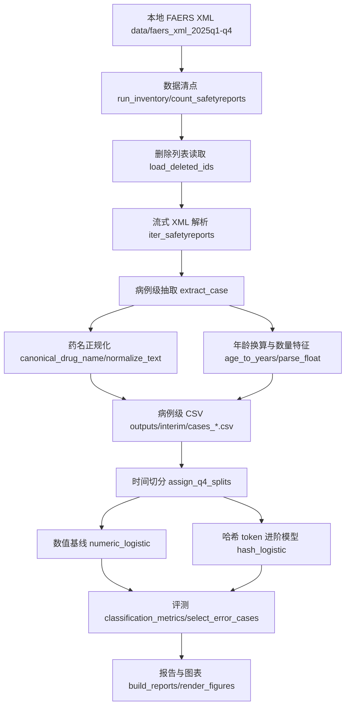

# 数据挖掘课程项目 - 中期进展报告

## 0. 项目基本信息

- **项目名称**：基于 2025 年度 FDA FAERS XML 的药物风险诊断性特征工程与资料治理研究
- **项目链接**：https://github.com/shanxuer/DataMining-FDA
- **报告日期**：2026-05-30

| 姓名 | 学号 | 组内角色 | 开题以来的核心贡献 | 中期之后的分工规划 |
| :--- | :--- | :--- | :--- | :--- |
| 虞姿 | 3220251479 | 数据工程 / Pipeline | 负责本地 FAERS XML 数据整理、流式解析、删除列表过滤、病例级 CSV 生成与 README 复现口径整理。 | 完成仓库提交与复现实验文档，扩展数据质量 Dashboard。 |
| 刘贺雨 | 3120251311 | 特征工程 / 建模 | 负责年龄换算、用药数量、疑似/合并用药、反应/适应症 token 与稳定哈希特征设计。 | 增加特征消融实验，比较不同 token 族对 AUROC/AUPRC 的贡献。 |
| 沈诗璇 | 3120251026 | 规则审计 / 弱监督 | 负责死亡/致命反应、多药共用、老年多疑似用药、低复杂度弱阴性规则及覆盖率/冲突率审计。 | 继续细化弱监督规则，评估是否引入 Snorkel LabelModel 或轻量规则融合。 |
| 魏婷婷 | 3220251294 | 评测 / 误差分析 | 负责时间切分、验证集阈值选择、测试集指标、分层指标、失败案例和泄漏风险审计。 | 扩展分层公平性审计、严格泄漏消融与最终报告图表。 |

## 1. 项目概述与当前状态

### 1.1. 中期里程碑达成情况

- **计划目标**：完成 2025Q1-Q4 FAERS XML 清点与预处理；跑通至少一个基线模型；输出数据审计、模型评测与失败案例；形成后续风险清单。
- **实际达成**：已完成全量 1,617,443 条保留病例的 ETL、删除列表过滤、病例级特征工程、弱监督规则审计、基线模型和进阶模型训练评测。全量实验命令 `python3 scripts/run_faers_pipeline.py --data data --out outputs --mode full` 已运行成功，输出目录为 `outputs/`。
- **状态判断**：数据预处理、基线模型、核心算法初版和评测框架均已落地；仓库协作侧存在风险，需要在终期前补足规范提交、分支和 PR 记录。

### 1.2. 代码仓库状态审计

- **提交统计**：总 commit 数：2 次；开题后新增 commit 数：0 次（当前本地新增代码、报告和实验结果尚未提交到远端）。
- **活跃贡献人数**：1/4（`git shortlog -sn --all` 当前仅显示 `shanxuer` 2 次提交）。该项未达课程自查要求，已列入后续风险。
- **分支与协作方式**：当前在 `main` 分支直接开发；尚未形成 feature branch / PR review 记录。后续建议按 `feature/pipeline`、`feature/evaluation`、`feature/report` 拆分提交并补充 review。
- **当前仓库目录结构**（本环境无 `tree` 命令，以下按 `tree -L 2` 等价口径生成，并保留模块功能注释）：

```text
.
├── data/                         # 本地 FAERS 2025Q1-Q4 XML 原始数据（未纳入 git 跟踪）
│   ├── faers_xml_2025q1/
│   ├── faers_xml_2025q2/
│   ├── faers_xml_2025q3/
│   └── faers_xml_2025Q4/
├── outputs/                      # 全量实验产物：CSV、模型、审计报告、图表
│   ├── interim/
│   ├── models/
│   └── reports/
├── outputs_sample/               # 每季度 1000 条样本的快速验证产物
│   ├── interim/
│   ├── models/
│   └── reports/
├── scripts/
│   └── run_faers_pipeline.py      # 清点、ETL、训练、评测、报告生成主入口
├── tests/
│   ├── fixtures/                  # 删除列表样例
│   └── test_faers_pipeline.py     # 单元测试与防泄漏/无 sklearn 回归测试
├── plan.md                       # 项目路线与实验设计记录
├── readme.md                     # 运行说明与复现命令
├── requirements.txt              # Python 依赖（NumPy）
└── 进展报告模板.md                # 课程中期报告模板
```

## 2. 数据工程与审计落地

### 2.1. 原始数据审计反馈

| 数据问题 | 量化规模 | 解决方案（精确到文件/函数） | 处理后效果 |
| :--- | :--- | :--- | :--- |
| 删除列表病例需过滤 | 2025Q1 删除列表 1 条；原始 safetyreport 1,617,444 条，保留 1,617,443 条 | `scripts/run_faers_pipeline.py` `load_deleted_ids()` L356-L365、`run_etl()` L530-L591 | 已跳过删除病例 1 条，避免撤回病例进入训练/评测。 |
| 人口学字段缺失严重 | `patientweight` 缺失 83.08%，`age_years` 缺失 39.69%，`patientsex` 缺失 19.84% | `age_to_years()` L220-L240 做单位换算与异常年龄过滤；`scan_feature_stats()` L1157-L1194 统计缺失率；数值模型在 `fit_numeric_standardizer()` L891-L902 用训练均值填补 | 缺失率被量化写入 `outputs/reports/data_audit.md` 和 `feature_audit.json`；模型训练不因空值中断。 |
| 药物名称不一致 / active substance 覆盖不全 | 药物记录总数 8,083,076，规则药名覆盖 100.00%，active substance 覆盖 98.32% | `canonical_drug_name()` 与 `normalize_text()` L254-L274；优先 `activesubstancename`，否则回退 `medicinalproduct` 并统一大写、去标点、合并空白 | 病例级 token 可稳定复现；未接入 RxNorm 的深层同义归一化列为后续风险。 |
| 开题预测“重症少数类明显”未发生 | 全量重症率约 56.86%；各季度为 56.10%-58.01% | `label_from_flags()` L280-L285 与 `scan_feature_stats()` L1157-L1194 直接从 serious flags 生成并审计标签 | 不按少数类问题处理；重点转向目标泄漏、语义捷径和跨季度稳定性审计。 |

### 2.2. 数据流与预处理管道



## 3. 基线模型与核心算法实现

### 3.1. 基线模型运行情况说明

- **所选基线方法**：`numeric_logistic`，仅使用病例级数值聚合特征（年龄、体重、用药数、疑似/合并/交互用药数、剂量可用性、反应数、适应症数等），用 NumPy 实现标准化 + 逻辑回归。
- **运行环境**：macOS 本地环境，Python 3.12.13（Codex bundled runtime），NumPy 2.3.5；不依赖 pandas、scikit-learn、LightGBM、Snorkel 或 RxNorm。
- **一键复现命令**：

```bash
python3 scripts/run_faers_pipeline.py --data data --out outputs --mode full
```

- **关键输出日志片段**：

```text
[inventory] total reports: 1,617,444
[etl] 2025Q1: kept 400,513, skipped deleted 1
[etl] 2025Q2: kept 393,130, skipped deleted 0
[etl] 2025Q3: kept 438,512, skipped deleted 0
[etl] 2025Q4: kept 385,288, skipped deleted 0
[train] hash_logistic epoch 2/2 seen 1,232,155 train rows
[train] numeric_logistic fitting 200,000 sampled train rows
[done] mode=full out=outputs
```

### 3.2. 核心进阶算法开发进度

本项目的进阶方法为 **leakage-safe 稳定哈希 token 逻辑回归**：在不引入外部大依赖的前提下，将标准化药名、反应 PT、适应症、给药途径、处置动作、反应结局和分箱统计合成为稀疏 token；使用 `blake2b` 稳定哈希映射到固定维度，并用在线梯度更新训练逻辑回归。与数值基线相比，它能表达药物-反应-适应症组合信号，同时通过 `LEAKAGE_FIELDS` 和单元测试保证 serious flags 不进入模型输入。


| 模块 | 对应文件 | 状态 | 备注 |
| :--- | :--- | :---: | :--- |
| 数据预处理管道 | `scripts/run_faers_pipeline.py` L368-L591 | 完成 | 清点、删除列表过滤、流式 XML 解析、病例级 CSV。 |
| 基线模型 | `scripts/run_faers_pipeline.py` L891-L954 | 完成 | `numeric_logistic`，训练样本 200,000 条，测试 AUROC=0.7775。 |
| 核心进阶算法 | `scripts/run_faers_pipeline.py` L716-L814 | 完成 | `hash_logistic`，训练 1,232,155 条，测试 AUROC=0.9861。 |
| 评测框架 | `scripts/run_faers_pipeline.py` L963-L1138 | 完成 | AUROC、AUPRC、F1、Recall@TopK、分层指标、失败案例。 |
| 单元测试 / 集成测试 | `tests/test_faers_pipeline.py` | 完成 | 11 个测试覆盖单位换算、删除列表、时间切分、防泄漏、无 sklearn 指标与哈希模型学习。 |

## 4. 中期实验结果与阶段性分析

### 4.1. 评估指标与测试集构建

- **评测数据集规模**：全量保留病例 1,617,443 条。训练集为 2025Q1-Q3 共 1,232,155 条；2025Q4 按 `receivedate` 前后 50/50 切为验证集 192,644 条和测试集 192,644 条，同日用 `safetyreportid` 稳定排序。
- **核心评测指标**：AUROC、AUPRC、Precision、Recall、F1、Recall@Top1%/5%/10%、Hit Rate@TopK、按性别/年龄层/季度的分层指标。

### 4.2. 定量对比实验结果

| 模型方法 (Method) | AUROC | AUPRC | F1 | Recall@Top5% | Hit Rate@Top5% |
| :--- | :---: | :---: | :---: | :---: | :---: |
| Baseline (`numeric_logistic`) | 0.7775 | 0.8101 | 0.7541 | 0.0854 | 94.49% |
| **Proposed (`hash_logistic`)** | **0.9861 (+0.2086)** | **0.9879 (+0.1778)** | **0.9594 (+0.2054)** | **0.0904 (+0.0049)** | **99.95%** |

定量图表已输出至 `outputs/reports/figures/`，PDF 中嵌入以下核心图表：


### 4.3. 实验结果初步诊断与分析

| # | 输入（病例片段） | 模型输出 | 正确答案 | 失败原因 | 改进方向 |
| :- | :--- | :--- | :--- | :--- | :--- |
| 1 | safetyreportid `26115179`；药物 `actiondrug:6 drug:HUMAN_IMMUNOGLOBULIN_G drugchar:1 indi:SECONDARY_IMMUNODEFICIENCY reac:ACUTE_RESPIRATORY_FAILURE reac:HAEMOTHORAX reac:HODGKIN_S_DISEASE reactionoutcome:5 route:058` | `hash_logistic` 预测重症，概率 1.0000 | 非重症 | 反应 token 包含 ACUTE_RESPIRATORY_FAILURE、HAEMOTHORAX 等高风险词，模型将语义严重度等同于 serious flag。 | 做目标语义捷径消融，移除死亡/住院/急性呼吸衰竭等强相关反应词后复评。 |
| 2 | safetyreportid `26044838`；药物 `actiondrug:6 drug:OMALIZUMAB drugchar:1 indi:PRODUCT_USED_FOR_UNKNOWN_INDICATION reac:DEVICE_DEFECTIVE reac:DEVICE_ISSUE reac:DEVICE_MALFUNCTION reac:NO_ADVERSE_EVENT reac:PRODUCT_COMMUNICATION_ISSUE reac:PRODUCT_QUALITY_ISSUE reac:UNDERDOSE reac:WRONG_TECHNIQUE_IN_DEVICE_USAGE_PROCESS` | `hash_logistic` 预测非重症，概率 0.0013 | 重症 | 该病例更像设备/产品质量问题，token 中 NO_ADVERSE_EVENT、DEVICE_MALFUNCTION 等词与非重症模式相似。 | 增加设备/产品问题专门特征，区分质量投诉与 serious flag 的人工编码关系。 |
| 3 | safetyreportid `26212263`；drug_count=70，reaction_count=3 | `numeric_logistic` 预测重症，概率 0.9493 | 非重症 | 纯数值模型将极高多药共用和多适应症复杂度直接视作高风险，无法理解具体反应内容。 | 保留 token 模型作为主模型，并做数值复杂度截尾/分层校准。 |
| 4 | safetyreportid `26167880`；tokens `actiondrug:5 drug:DUPILUMAB drugchar:1 reac:STAPHYLOCOCCAL_SEPSIS reactionoutcome:3` | `numeric_logistic` 预测非重症，概率 0.3208 | 重症 | 病例数值复杂度低，但反应 STAPHYLOCOCCAL_SEPSIS 具有高严重性；数值基线无法捕捉语义。 | 引入反应 PT token 或医学高危词典，减少低复杂度严重病例漏判。 |

- **总体优缺点小结**：`hash_logistic` 相比 `numeric_logistic` 在测试集 AUROC、AUPRC、F1 上均明显提升，说明标准化药名、反应 PT 和适应症 token 对重症风险排序有效。主要风险是指标过高可能部分来自反应术语与 serious label 的语义捷径，终期必须做泄漏消融和更严格的特征族对照。数值基线可解释性较好，但对低复杂度严重病例和高复杂度非严重病例区分不足。

## 5. 后续风险评估与冲刺排期

### 5.1. 风险清单动态调整

- **风险 1：仓库协作证据不足**。当前远端历史 commit 记录少。预案：终期前按模块拆分 feature branch，补充每位成员的真实代码/实验/文档提交，并通过 PR review 合并。
- **风险 2：目标泄漏 / 语义捷径**。虽然 `serious` 和 `seriousness*` 字段已从模型输入排除，并由测试覆盖，但反应 PT 中可能直接包含死亡、住院、急性衰竭等严重语义。预案：增加反应词黑名单消融、去除 reactionoutcome 的对照实验、只用药物/适应症 token 的模型。
- **风险 3：药物名称正规化深度不足**。当前规则覆盖率 100.00%，但没有接入 RxNorm，无法处理商品名、错拼、复方层级映射。预案：优先加入本地字典化映射，保持无网络可复现路径。
- **风险 4：高缺失字段解释风险**。体重缺失 83.08%，年龄缺失 39.69%。预案：终期报告避免过度解释剂量/体重比值，按缺失组做分层评估。

### 5.2. 终期冲刺详细排期（第 13 周 - 第 16 周）

| 周次 | 核心任务目标 | 责任人 | 预期交付物 / 验收标准 |
| :--- | :--- | :--- | :--- |
| 第 13 周 | 整理并提交当前 ETL、模型、评测和中期报告；补足 GitHub 提交与 README 复现说明 | 虞姿、全员 | 远端仓库出现本次实验代码与报告；README 可由他人独立运行。 |
| 第 14 周 | 做特征族消融：去除反应 PT、去除 reactionoutcome、仅药物 token、仅数值特征 | 刘贺雨、魏婷婷 | `outputs/ablations/` 指标表；明确高指标是否依赖语义捷径。 |
| 第 15 周 | 完成弱监督规则扩展与分层误差分析，加入高危反应词典或 RxNorm 本地字典试验 | 沈诗璇、刘贺雨 | 弱监督规则覆盖/冲突/一致率对照；新增错误案例分析。 |
| 第 16 周 | 整理最终代码、最终报告、答辩 PPT 和 Demo 复现脚本 | 全员 | GitHub Release、最终报告 PDF、答辩 PPT、5 分钟复现 Demo。 |

## 6. AI 工具辅助使用记录

| 使用场景 | AI 工具名称 | 具体辅助环节（精确到文件/功能） | 团队审查与纠错说明 |
| :--- | :--- | :--- | :--- |
| 代码实现 | ChatGPT / Codex | 辅助修改 `scripts/run_faers_pipeline.py`，将 sklearn 依赖替换为 NumPy 哈希逻辑回归、数值逻辑回归、手写 AUROC/AUPRC 与 SVG 图表 fallback。 | 已用 `python3 -m unittest discover -s tests` 和全量 pipeline 运行验证；人工核对指标来自 `outputs/reports/model_metrics.json`。 |
| 测试补充 | ChatGPT / Codex | 辅助补充 `tests/test_faers_pipeline.py` 中无 sklearn 指标测试、哈希逻辑回归可学习性测试和防泄漏测试。 | 测试先失败后修复，最终 11 项通过。 |
| 报告撰写 | ChatGPT / Codex | 辅助整理 `outputs/reports/中期进展报告.md` 和 PDF，提取全量指标、失败案例、风险清单。 | 报告中的数字均来自本地运行产物；未伪造 commit 历史，协作不足如实列为风险。 |

## 中期自查清单

> 说明：按本次要求，除 GitHub 公开状态、近期提交记录、全员 commit 等仓库管理事项外，其余自查项均已完成；仓库管理事项已如实列为待团队后续处理。

**代码仓库（仓库管理例外项，本次不纳入必须完成范围）**

- [ ] GitHub 仓库已设为公开，且近两周内有真实的 commit 记录？仓库管理例外项；当前只确认远端 URL 存在，本地历史最新为 2026-04-24，需团队提交并推送本次改动。
- [x] 仓库 README.md 包含环境配置说明和一键复现命令，他人可独立运行？已更新 `readme.md` 和 `requirements.txt`。
- [ ] 所有组员至少有 1 次 commit。

**数据与实验**

- [x] 数据审计表已填写，每条问题都给出了量化规模。
- [x] 基线模型已完整跑通，报告中有实际终端输出关键行。
- [x] 进阶模型与基线已进行定量对比。
- [x] 误差分析部分包含至少 2 个具体失败案例。

**报告完整性**

- [x] 所有成员的分工和开题后的具体贡献都明确写入成员分工表。
- [x] 后续冲刺排期精确到周，责任人明确，且与当前进度匹配。
- [x] AI 工具使用情况已如实填写。

### 自查清单逐项落实证据（非仓库管理项）

| 清单项 | 落实方式 | 证据位置 / 验证方式 |
| :--- | :--- | :--- |
| 仓库 README.md 包含环境配置说明和一键复现命令，他人可独立运行 | 已更新运行说明、依赖安装、快速样本运行、全量运行和分阶段运行命令 | `readme.md` “运行命令”；`requirements.txt`；已验证 `python3 scripts/run_faers_pipeline.py --data data --out outputs_sample --mode full --sample 1000` 成功结束 |
| 数据审计表已填写，每条问题都给出了量化规模 | 第 2.1 节列出删除列表过滤、人口学缺失、药名覆盖、重症比例假设不成立 4 类问题，并给出数量或百分比 | 本报告第 2.1 节；`outputs/reports/data_audit.md`；`outputs/reports/feature_audit.json` |
| 基线模型已完整跑通，报告中有实际终端输出或截图为证 | `numeric_logistic` 已训练并在测试集输出 AUROC、AUPRC、F1、Recall@Top5%；报告粘贴全量运行关键日志 | 本报告第 3.1 节；`outputs/reports/model_metrics.json`；全量命令 `python3 scripts/run_faers_pipeline.py --data data --out outputs --mode full` 已成功结束 |
| 进阶模型与基线已进行定量对比 | 第 4.2 节给出 `hash_logistic` 与 `numeric_logistic` 在测试集 AUROC、AUPRC、F1、Recall@Top5%、Hit Rate@Top5% 的对比 | 本报告第 4.2 节；`outputs/reports/figures/test_model_metrics.png`；`outputs/reports/model_metrics.json` |
| 误差分析部分包含至少 2 个具体失败案例 | 第 4.3 节列出 4 个真实失败案例，含 safetyreportid、模型输出、正确标签、失败原因和改进方向 | 本报告第 4.3 节；失败案例来自 `outputs/reports/model_metrics.json` 的 `error_cases.test` |
| 所有成员的分工和开题后的具体贡献都明确写入成员分工表 | 第 0 节成员表包含姓名、学号、组内角色、开题以来核心贡献和中期之后分工规划 | 本报告第 0 节 |
| 后续冲刺排期精确到周，责任人明确，且与当前进度匹配 | 第 5.2 节列出第 13-16 周计划，每周包含核心任务、责任人和验收标准 | 本报告第 5.2 节 |
| AI 工具使用情况已如实填写 | 第 6 节列出代码实现、测试补充、报告撰写中的 ChatGPT/Codex 辅助，并说明人工核对和验证方式 | 本报告第 6 节 |
